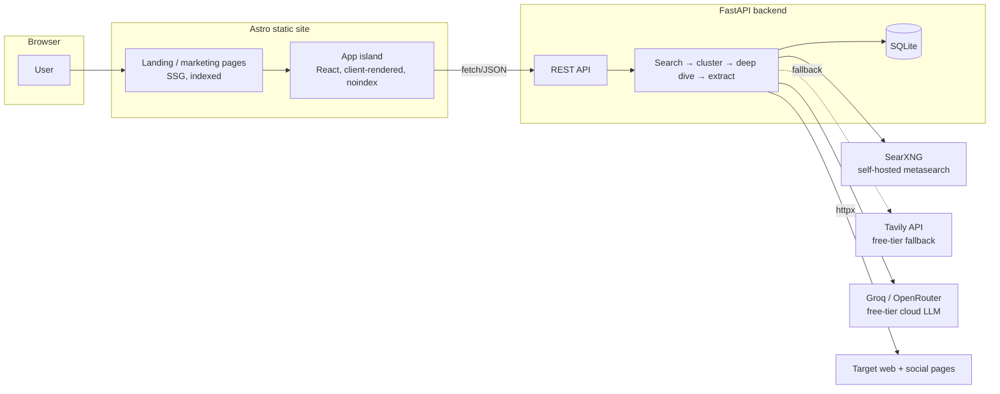
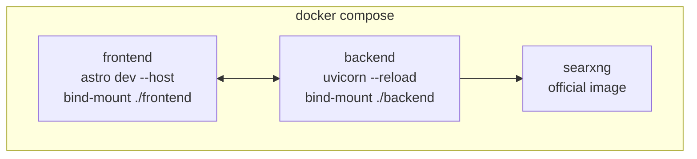

# ARCHITECTURE

## System diagram

## Components

| Component | Tech | Responsibility |
|---|---|---|
| Marketing site | Astro (SSG) | Landing, how-it-works, SEO. Zero JS by default. |
| App island | React (or Preact), mounted in one Astro page | Search form, candidate picker, profile view. `noindex`. |
| Backend | FastAPI (Python, async) | Orchestrates search → cluster → deep dive → extract. Only place holding API keys. |
| Search provider | SearXNG (self-hosted, primary) + Tavily (free-tier fallback) | Broad + scoped queries, including per-platform `site:` searches. See [SCRAPING_SOURCES.md](./SCRAPING_SOURCES.md) for why. |
| Deep-dive fetch | `httpx` + `BeautifulSoup` | Server-side page fetch on chosen candidate's links only — general web pages and, best-effort, public social profile meta tags. No CORS issue — runs on the backend, not the browser. |
| LLM | Groq (primary) → OpenRouter (fallback), structured output, both cloud-hosted | Clustering call + extraction call. See [LLM_PIPELINE.md](./LLM_PIPELINE.md) for the free-tier-first rationale. |
| Storage | SQLite (file-based) | Searches, candidates, profiles, sources. One file, zero ops for POC. |

## Why this split

- Astro for the marketing shell: static HTML, best-effort SEO, near-zero JS shipped.
- One React island for the actual app: the search/candidate/profile flow is inherently interactive and per-user — no SEO value, so it doesn't need to be static.
- FastAPI, not a client-only app: real page scraping needs a server (browser `fetch` hits CORS on almost every third-party site) and API keys can't live in browser JS beyond a personal-use POC.
- SQLite, not Postgres: POC is single-instance, no concurrent-write pressure yet. Swap when that changes — don't build for it now.
- SearXNG self-hosted, not a paid search API, as the primary provider: it's free with no query cap and no API key, and it runs as just another container next to the app. Google Custom Search — the original pick — closed to new customers in 2025 and shuts down entirely on 2027-01-01, so it's not viable for a fresh signup. Tavily's real (recurring, 1,000/mo) free tier is the fallback when SearXNG comes back thin or isn't running (e.g. a quick cloud demo). Full comparison and why Brave/DuckDuckGo were ruled out: [SCRAPING_SOURCES.md](./SCRAPING_SOURCES.md).
- Groq → OpenRouter, not a paid frontier model, for the POC LLM: both are cloud-hosted with workable free tiers, so there's no local-model ops weight (GPU/RAM sizing, model pulls, slower cold starts) to carry for a POC. Swap in a paid model later only once free-tier throughput or extraction quality is the actual bottleneck. Details: [LLM_PIPELINE.md](./LLM_PIPELINE.md).

## Local development (Docker)

Everything the POC needs runs via `docker compose up`, with hot reload on both sides — no local Python/Node version wrangling.

| Service | Image/base | Hot reload mechanism |
|---|---|---|
| `frontend` | `node:*-slim` + Astro | Bind-mount `./frontend:/app`, named volume for `node_modules` (avoids host/container native-module mismatch), `astro dev --host 0.0.0.0`. Vite HMR websocket port published to the host. |
| `backend` | `python:*-slim` + FastAPI | Bind-mount `./backend:/app`, `uvicorn app.main:app --reload --host 0.0.0.0 --reload-exclude '*.db'` (exclude the SQLite file so writes don't trigger reload storms). |
| `searxng` | `searxng/searxng` (official) | No app code to reload — config volume only. |

- `docker compose up`: `frontend` + `backend` + `searxng`, LLM calls go to Groq/OpenRouter (cloud, see [LLM_PIPELINE.md](./LLM_PIPELINE.md)) using a key from `.env`. No local-model service — both LLM providers are hosted.
- SQLite file lives in a bind-mounted `./backend/data` directory so it survives container restarts.
- `docker-compose.yml`, the two `Dockerfile`s, and `.env.example` land alongside the actual backend/frontend scaffolding — this section documents the target shape, not yet-written files.

## Deployment

**Local dev** — Docker Compose as above. This is the primary POC workflow; no cloud deploy needed to develop or demo.

**Optional hosted POC**
- Astro build → static host (Vercel / Netlify / Cloudflare Pages). Free tier, CDN, done.
- FastAPI → single small instance (Fly.io / Railway / a VPS). One process, SQLite file on the same disk, SearXNG as a sidecar container or a second small instance.
- Two deploys, two repos or a monorepo with two build targets — not decided, doesn't matter yet.

## Secrets

| Var | Used by | Notes |
|---|---|---|
| `GROQ_API_KEY` | backend | Primary LLM provider (cloud). Free tier, no card required. |
| `OPENROUTER_API_KEY` | backend | Secondary LLM fallback pool (cloud). Optional — only needed if Groq's free-tier RPM/RPD is hit. |
| `TAVILY_API_KEY` | backend | Search fallback when SearXNG is unavailable or returns thin results. Optional for local dev (SearXNG needs no key at all). |
| `SEARXNG_URL` | backend | Points at the `searxng` compose service (e.g. `http://searxng:8080`) — not a secret, just config. |
| `LLM_PROVIDER` | backend | `groq` (default) / `openrouter` — selects the active LLM backend. |

All secrets live server-side only. The frontend never sees an API key. SearXNG needs no key for search; a free `GROQ_API_KEY` (no card) is the one signup required to exercise the LLM calls end-to-end.
