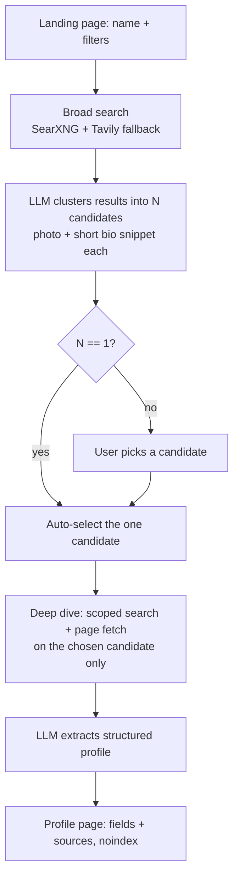

# CONCEPT — WhoIs

## What it is

Type a person's name (+ optional filters: country, age range, occupation, known aliases), get back a structured, source-cited profile — OSINT style.

## Why it's hard

Not the scraping. It's **name collision** — "John Smith" is 500 different people. Solve order:

1. Broad search first, cluster into N distinct candidate subjects.
2. If N > 1, user picks which one they mean.
3. Only then go deep — scoped to the chosen subject.
4. Extract a structured profile, every field traceable to a source.

## User flow

Full field list: see [DATA_MODEL.md](./DATA_MODEL.md). Endpoint shapes: see [API_CONTRACT.md](./API_CONTRACT.md).

## Phases

**POC (now)**
- Astro static frontend + FastAPI backend, running locally via Docker Compose with hot reload on both sides — see [ARCHITECTURE.md](./ARCHITECTURE.md)
- Free-tier-first stack, deliberately: SearXNG (self-hosted) + Tavily fallback for search, Groq + OpenRouter (both cloud) for the LLM — no paid API required to run the POC end to end. See [SCRAPING_SOURCES.md](./SCRAPING_SOURCES.md) and [LLM_PIPELINE.md](./LLM_PIPELINE.md) for why each was picked over the alternatives.
- Deep dive: scoped search queries + direct page fetch (server-side, no CORS issue), including best-effort public discovery on Instagram/Facebook/X/LinkedIn/TikTok/YouTube via search — never authenticated scraping
- Storage: SQLite
- Public web + public-search-indexed social presence only — nothing behind a login wall

**Later, add only when it's the actual bottleneck**
- LinkedIn / social media connectors (each is its own ToS minefield, opt-in modules)
- Headless browser (Playwright) for JS-heavy / bot-guarded pages
- Background job queue + progress streaming, once single-request latency hurts
- Postgres, once SQLite's concurrency limits actually bite
- Caching layer for repeat searches on the same name

## Privacy & legal — don't skip this

This profiles real people from public data. Before this goes past personal/local use:

- Profile pages must be `noindex` — never let a generated profile get crawled and cached by Google itself.
- Respect `robots.txt` and rate-limit outbound scraping (see [SCRAPING_SOURCES.md](./SCRAPING_SOURCES.md)).
- Use paid search APIs, not direct Google scraping — ToS and stability both matter.
- Every profile field carries its source — no field renders without one. This is non-negotiable, not a nice-to-have.
- Log usage / require a stated purpose before any multi-user deployment. Not solved yet — flagged for when it matters.
