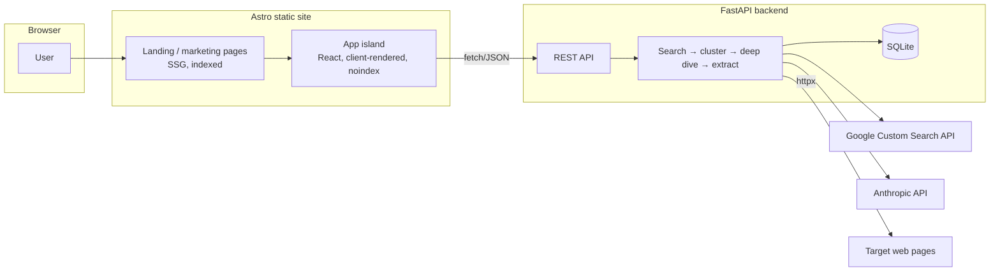

# ARCHITECTURE

## System diagram

## Components

| Component | Tech | Responsibility |
|---|---|---|
| Marketing site | Astro (SSG) | Landing, how-it-works, SEO. Zero JS by default. |
| App island | React (or Preact), mounted in one Astro page | Search form, candidate picker, profile view. `noindex`. |
| Backend | FastAPI (Python, async) | Orchestrates search → cluster → deep dive → extract. Only place holding API keys. |
| Search provider | Google Custom Search JSON API | Broad + scoped queries. Not scraped directly — paid API, ToS-safe. |
| Deep-dive fetch | `httpx` + `BeautifulSoup` | Server-side page fetch on chosen candidate's links only. No CORS issue — this runs on the backend, not the browser. |
| LLM | Anthropic API (Claude), structured output | Clustering call + extraction call. See [LLM_PIPELINE.md](./LLM_PIPELINE.md). |
| Storage | SQLite (file-based) | Searches, candidates, profiles, sources. One file, zero ops for POC. |

## Why this split

- Astro for the marketing shell: static HTML, best-effort SEO, near-zero JS shipped.
- One React island for the actual app: the search/candidate/profile flow is inherently interactive and per-user — no SEO value, so it doesn't need to be static.
- FastAPI, not a client-only app: real page scraping needs a server (browser `fetch` hits CORS on almost every third-party site) and API keys can't live in browser JS beyond a personal-use POC.
- SQLite, not Postgres: POC is single-instance, no concurrent-write pressure yet. Swap when that changes — don't build for it now.

## Deployment (POC)

- Astro build → static host (Vercel / Netlify / Cloudflare Pages). Free tier, CDN, done.
- FastAPI → single small instance (Fly.io / Railway / a VPS). One process, SQLite file on the same disk.
- Two deploys, two repos or a monorepo with two build targets — not decided, doesn't matter yet.

## Secrets

| Var | Used by | Notes |
|---|---|---|
| `GOOGLE_CSE_API_KEY`, `GOOGLE_CSE_CX` | backend | Custom Search Engine credentials |
| `ANTHROPIC_API_KEY` | backend | Never shipped to the frontend |

All secrets live server-side only. The frontend never sees an API key — closes the "key exposed in browser" gap the client-only version had.
