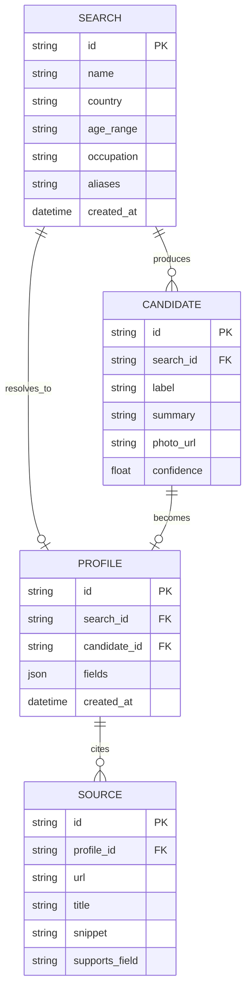

# DATA_MODEL

## Entities

## Tables (SQLite, POC)

**search** — one row per user query
| column | type | notes |
|---|---|---|
| id | text PK | uuid |
| name | text | required |
| country | text | nullable filter |
| age_range | text | nullable filter |
| occupation | text | nullable filter |
| aliases | text | nullable, comma-separated |
| created_at | datetime | |

**candidate** — one row per clustered subject from broad search
| column | type | notes |
|---|---|---|
| id | text PK | uuid |
| search_id | text FK → search.id | |
| label | text | e.g. "John Smith, software engineer, Seattle" |
| summary | text | 1-2 sentence LLM blurb |
| photo_url | text | nullable |
| confidence | real | LLM's own confidence this is a distinct person, 0-1 |

**profile** — final structured result, one per resolved search
| column | type | notes |
|---|---|---|
| id | text PK | uuid |
| search_id | text FK → search.id | |
| candidate_id | text FK → candidate.id | nullable if N==1 (skip step) |
| fields | json | see field list below |
| created_at | datetime | |

**source** — every fact's citation
| column | type | notes |
|---|---|---|
| id | text PK | uuid |
| profile_id | text FK → profile.id | |
| url | text | |
| title | text | |
| snippet | text | the exact text the field was drawn from |
| supports_field | text | which `fields` key this backs, e.g. `"education"` |

## Profile field list (`profile.fields` JSON)

| field | type | nullable | example |
|---|---|---|---|
| `full_name` | string | no | "Jonathan A. Smith" |
| `aliases` | string[] | yes | ["Jon Smith"] |
| `location_current` | string | yes | "Seattle, WA" |
| `location_history` | string[] | yes | ["Chicago, IL"] |
| `occupation` | string | yes | "Software Engineer" |
| `employer` | string | yes | "Acme Corp" |
| `education` | object[] | yes | [{institution, degree, year}] |
| `social_profiles` | object[] | yes | [{platform, url, confidence}] |
| `photos` | string[] | yes | image URLs |
| `summary` | string | no | 2-3 sentence LLM synthesis |

Rule, not a suggestion: every non-null field must have ≥1 row in `source` with `supports_field` matching it. If extraction can't cite a source, the field stays null — never rendered unsourced.
